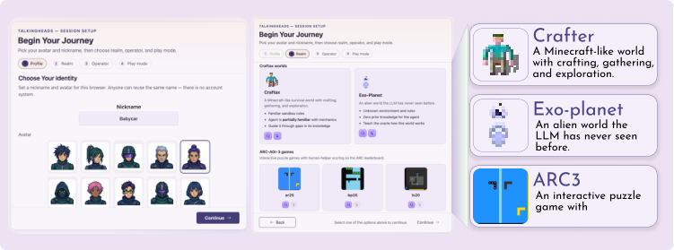
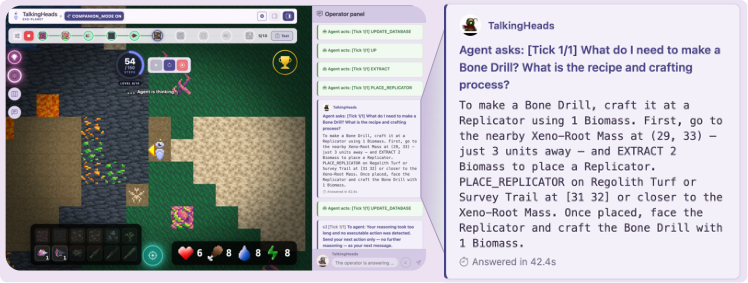

# TalkingHeads

TalkingHeads is an interactive platform for studying LLM agents that act in
unfamiliar environments, ask an operator for help, and continue from grounded
dialogue. The public demo release supports Craftax-style worlds, an
Exo-Planet transfer setting, and ARC-AGI-3 human-helper workflows.

<p align="center">
  
</p>

<p align="center">
  
</p>

<p align="center">
  <em>Figure 2 from the paper draft: setup wizard and live operator session.</em>
</p>

## Demo Materials

- Project page: `https://iameteron.github.io/TalkingHeads/` after GitHub Pages
  is enabled.
- Code: this repository.
- Live demo: `http://158.160.220.30/play/`
- Demo video: `https://drive.google.com/drive/folders/1VxMYtPXQKqoAb97vEC6mSYDqJB_hxNaS?usp=sharing`
- Prompts: see `MegaPrompt/` and `oracle/prompts/texts/`.
- License: MIT for TalkingHeads source code; third-party components retain
  their upstream licenses.

## What Is Included

- Web UI for selecting worlds, configuring demo modes, inspecting prompts,
  controlling the agent, and interacting with an operator.
- Server runtime for agent-environment interaction, operator routing,
  trajectory logging, dashboards, and leaderboard workflows.
- Prompt stacks for Craftax, Exo-Planet, and ARC-AGI-3.
- ARC-AGI-3 local integration for `ar25`, `bp35`, `ls20`, and `lp85`.
- Demo profile controls that hide API-key entry, prompt editing, and internal
  benchmark tools in public deployments.

## Quick Start

Create an environment and install the package:

```bash
conda create -n talkingheads python=3.12 -y
conda activate talkingheads
pip install -r requirements.txt
pip install -e .
```

Configure local secrets in a non-committed `.env` file:

```bash
cp .env.example .env
# Edit .env and set OPENROUTER_API_KEY or HF_TOKEN as needed.
```

Start the local web app:

```bash
cd play_web
./scripts/play-serve.sh start
```

Default local URLs:

- UI: `http://127.0.0.1:8089/client/index.html`
- API docs: `http://127.0.0.1:8001/docs`

Stop the app:

```bash
cd play_web
./scripts/play-serve.sh stop
```

## Demo Profile

For a public-facing deployment, run the app in demo mode:

```bash
TALKINGHEADS_APP_PROFILE=demo
TALKINGHEADS_DEMO_AGENT_MODEL=anthropic/claude-sonnet-4.5
TALKINGHEADS_DEMO_ARC_OBS_FORMAT=arc_image
```

In demo mode, API keys should be supplied through server environment variables,
not committed files and not public client-side inputs.

## Repository Map

- `play_web/`: browser UI, FastAPI server, runtime, dashboards, and scripts.
- `oracle/`: agent wrappers, expert routing, prompt generation, and utilities.
- `MegaPrompt/`: prompt and observation rendering families.
- `docs/`: public documentation and GitHub Pages landing page.
- `examples/`: focused local checks and benchmarking helpers.
- `config/`: example oracle configuration.

## Documentation

- `docs/index.html`: GitHub Pages landing page.
- `docs/ARC_AGI_3.md`: ARC-AGI-3 integration notes.
- `docs/APP_PROFILES.md`: dev/demo feature flags.
- `docs/CRAFTAX_ORACLE.md`: Craftax oracle notes.
- `MegaPrompt/README.md`: prompt stack overview.

## Checks

Run a syntax check without writing bytecode into the repository:

```bash
PYTHONPYCACHEPREFIX=/tmp/talkingheads_pycache python -m compileall -q .
```

Focused ARC checks:

```bash
python -m pytest \
  oracle/prompts/test_arc_prompt_generation.py \
  play_web/server/test_arc_agi_adapter.py \
  play_web/server/test_arc_agent_parser.py
```

## Data And Secrets

Do not commit `.env`, API keys, raw trajectory dumps, local leaderboard logs, or
paper work directories. Use `.env.example` as the template for local secrets.

See `THIRD_PARTY_NOTICES.md` for dependency and asset notes.
